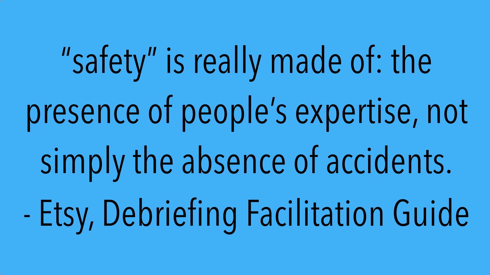

# Overview

Software is key to a growing number of businesses. This means working with software safely isn’t just prudent, it’s existential to many. The wrong kind of accident could wipe you out. Investigating incidents is a technique many businesses use to remediate issues that led to accidents in the first place. They hope it will help them reduce the number and scope of accidents in the future. While traditional accident investigation is problematic, Etsy use's a "New View" of safety to create better outcomes.
 
> “The purpose of an investigation is to understand how things usually go right as a basis for explaining how things occasionally go wrong.”   
> — Erik Hollnagel, Safety-I and Safety-II   
 
Traditional accident investigation has a flaw though. When it focuses on finding a cause or on the things people didn’t do, it prioritizes human error as the reason why an accident happened. And it reduces safety to a set of things people **should** do in the future. This traditional view hasn’t produced better outcomes, it’s not making things safer.
 
A number of experts have been defining a “New View” of safety though, one that is based on creating a path to safety through improvement and learning.
 
This new path depends on expertly facilitated post-mortem analysis.
 
Etsy embrace’s the “New View”, and therefore needed a way to train expert facilitators, so it created an internal training course, and this document summarizes the training.
 

 
**Key references**
 
* [The Field Guide to Understanding Human Error](https://www.routledge.com/The-Field-Guide-to-Understanding-Human-Error/Dekker/p/book/9781472439055) by Sidney Dekker 
* [Behind Human Error](https://bookshop.org/books/behind-human-error/9780754678342), by David Woods, Sidney Dekker, Richard Cook, Leila Johannesen, and Nadine Sarter 
* [Pre-Accident Investigations: An Introduction to Organizational Safety](https://bookshop.org/books/pre-accident-investigations-an-introduction-to-organizational-safety/9781409447825), by Todd Conklin 
* [Safety Differently](https://bookshop.org/books/safety-differently-human-factors-for-a-new-era-second-edition/9781138433038), by Sidney Dekker 
* [Engineering a Safer World](https://bookshop.org/books/engineering-a-safer-world-systems-thinking-applied-to-safety/9780262533690), by Nancy Leveson 
* [Safety-I and Safety-II: The Past and Future of Safety Management](https://bookshop.org/books/safety-i-and-safety-ii-the-past-and-future-of-safety-management/9781472423085), by Erik Hollnagel 
* [Normal Accidents: Living with High-Risk Technologies](https://bookshop.org/books/normal-accidents-living-with-high-risk-technologies-updated-edition-revised/9780691004129), by Charles Perrow
* [The Challenger Launch Decision](https://www.google.com/search?q=The+Challenger+Launch+Decision&oq=The+Challenger+Launch+Decision&aqs=chrome..69i57j69i64l3j69i60.386j0j7&sourceid=chrome&ie=UTF-8), by Diane Vaughan
* [Working Minds: A Practitioner’s Guide to Cognitive Task Analysis](https://mitpress.mit.edu/books/working-minds), by Beth Crandall, Gary Klein, and Robert Hoffman 
 
**Key Idea**
 
[Cognitive Task Analysis](https://en.wikipedia.org/wiki/Task_analysis): “**Task analysis** is the analysis of how a task is accomplished, including a detailed description of both manual and mental activities, task and element durations, task frequency, task allocation, task complexity, environmental conditions, necessary clothing and equipment, and any other unique factors involved in or required for one or more people to perform a given task.”
 
They focus on facilitations for 3 key reasons:
 
* There’s always a story to uncover: “finding all the things people actively do to keep the system running effectively is quite difficult, so an accident provides a unique opportunity for these underlying factors to be revealed.”
* Each story is important: There is immense value in differing perspectives, therefore collecting all the perspectives is important.
* Because everyone truly is an expert: “A debriefing is where you discover what makes people’s work difficult, and what makes them good at it, despite the difficulty. “
 
They suggest preparation techniques and a structure for the debrief.
 
**Prep**
 
* Familiarize Yourself With the Timeline in Advance: This sets you up, and provides a springboard for further discussion. The timeline is the skeleton of the debrief
* Unearth More Objective and Subjective Data: Enrich the timeline with data. Find turning points and surprise.
* Talk to those involved beforehand: Gauge anxiety ground them in expectations
* Come up with initial questions based on what you’ve found
 
**Structure**
 
* Set expectations: You are the leader, and your goal is not to prevent future incidents but to learn.
* Spend most of your time on the timeline: The backbone of the discussion, get folks to describe what they did at specific times.
* Capture alternative perspectives
* Focus on having folks describe their experience, how they arrived at certain points.
* Make sure that everyone agrees with the characterization of events before moving forward
* Use the remaining time for discussion: More like a brainstorming session remediation isn’t necessary.
* If remediation items come up make sure they are: “specific, measurable, achievable, relevant and time-bound, but don’t dismiss ideas that don’t conform to that criteria right off the bat.”
* Have folks marinate in the renditions and return to them a few days later
* Document all of this
 
**Goals**
 
* Vicarious Experiences: Expertise can be thought of as having diverse experience. Which can often take a long time. Post mortems can be a way to accelerate the development of expertise through vicarious experience.
* Learn how your organization works. Prevention is happening all the time. 
The goal is to take the opportunity to learn how your organization works. People were doing normal work on a normal day when the event took place.
 
**Questions**
 
The whole section on questions is a great read and easy to consume. I would recommend looking through it, and if you facilitate a debrief reviewing before you do it.
 
**Were you successful**
 
* Did at least one person learn one thing that will affect how they work in the future? 
* Did at least half of the attendees say they would attend another debrief in the future? 

# Notes

## Introduction

> “The purpose of an investigation is to understand how things usually go right as a basis for explaining how things occasionally go wrong.”   
> — Erik Hollnagel, Safety-I and Safety-II   

* Traditionally accident investigation is looking for the thing that didn’t happen 
    * ”Someone did not do something they should have, according to someone else.”
    * Investigations looks for the things we didn’t do
        * These are then labeled “human error”
        * and they are then called the cause
        * “Next time, do what you should.” 
    * Then, the findings are a list of things you should do next time
    * **This doesn’t make things safer though**

* There is a “New View” though, which changes the perspective and allows a new path to improvement and learning
* Etsy has chosen to embrace this new path

> “Adaptability and learning. We learn through honest, blameless reflection on lessons and surprises. We believe that traditional root- cause analysis makes learning from mistakes difficult. Our blameless post-mortem process is a widely-cited technique that we believe is becoming best practice among organizations that value innovation. **Blameless postmortems drive a significant percentage of our development as we analyze what about our production environment was less than optimal and rapidly make corresponding adjustments.**” — Etsy, Inc., 2015   

* **Debriefing is the core of the approach, there for hinges on the expertise of the facilitator.**
* Etsy developed an internal course to train facilitators
    * Three seminars covering the theoretical and empirical foundations of accident models, historical case studies, topics of “Just Culture” and Safety-I/II (with readings and written exercises) 
    * An interactive workshop for facilitators to practice core skills * Shadowing and feedback for new facilitators
    * Regular follow-up discussion groups 
* This guide is a distillation of the training

### What Brought Us to Write This

* Software is critical to the operation of modern business
* This will continue to grow
* Safety while working with software is key to the function of business

* They started this in engineering
* Over the years, more folks outside of engineering have performed debriefs and they’ve been more insightful
* 

### Who This Guide Is for

> This guide is intended to serve as a starting point for debriefing facilitators in organizations that rely on the successful design and operation of software.   

### Influences and Inspiration

* The Field Guide to Understanding Human Error by Sidney Dekker 
* Behind Human Error, by David Woods, Sidney Dekker, Richard Cook, Leila Johannesen, and Nadine Sarter 
* Pre-Accident Investigations: An Introduction to Organizational Safety, by Todd Conklin 
* Safety Differently, by Sidney Dekker 
* Engineering a Safer World, by Nancy Leveson 
* Safety-I and Safety-II: The Past and Future of Safety Management, by Erik Hollnagel 
* Normal Accidents: Living with High-Risk Technologies, by Charles Perrow
* The Challenger Launch Decision, by Diane Vaughan
* Working Minds: A Practitioner’s Guide to Cognitive Task Analysis, by Beth Crandall, Gary Klein, and Robert Hoffman 

**Critical Decision Method**

* Much of the approach is a translation of the Critical Decision Method
    * Which is a cognitive task analysis method
    * To understand how:
        * do people make decisions
        * pick up and understand cues in their environments
        * judge wether their actions will work
    * It’s semi-structured interview with targets questions
        * Focusing on decisions making and cognition
    * Scenarios are broken down in critical junctures and you can ask questions about those
    * Developed by Gary Klien in the 1980s

### Why We Focus on Facilitation Skills

**There are stories to uncover**

* People do what makes sense to them from their perspective
* The facilitators job is to understand what they did and what their perspective was at the time
* Get people to tell your their story
    * By asking questions
        * Pointed
        * Open Ended
        * Draw out descriptive details
        * Things they won’t say out loud otherwise
    * Hear and ask about peoples **descriptions** not their **explanations**
* You aren’t finding causes
* “finding all the things people actively do to keep the system running effectively is quite difficult, so an accident provides a unique opportunity for these underlying factors to be revealed.”

**Each story is essential**

* There’s no singular perspective on events in complex systems
* Only multiple perspectives: Sometimes they overlap, sometimes they don’t
* The job is not to unify the perspective 
* By gather all the view points you can compare and contrast them 

> **Because everyone truly is an expert**   
>   
> When we ask people for descriptions of their work, we hear about their expertise. We hear about the tips and tricks they’ve developed over their careers, like the shortcut shell aliases, special bookmarks, one-liner scripts, and the go-to graphs they always look at when diagnosing  
> certain problems.   
>   
> We hear about the procedures they always follow, and the ones they sometimes skip because if they followed them blindly and to the letter they’d have a bad day, guaranteed. We hear about what they usually do when that alert goes off and everything is fine again. When “this” and “that” happens, they do “these things,” but only in certain circumstances. We coax out the hidden nuances underlying their actions, decisions, and rationales.  
>   
> A debriefing is where you learn how the mechanic can just lift the hood of the car, listen to that faint hum of the engine, and intuit that it needs new valves.   
>   
> A debriefing is where you discover what makes people’s work difficult, and what makes them good at it, despite the difficulty.   

### The Benefit to Others: Vicarious Experiences

* Expertise comes from diverse experience
* Getting good at handling events with uncertainty is based on how many different kinds of incidents you’ve seen
* One way to accelerate the learning curve is to be exposed to rich descriptions of events
* This is anecdotally true, IE “War Stories”  are often compelling.
* **Given the value, the goal becomes how do you make sure you are getting the best responses.**

### The Goal Is to Learn, Not to Produce Remediation Items 

> “The problem comes when the pressure to fix outweighs the pressure to learn.”   
> —Todd Conklin, Pre-Accident Investigations   

It’s not surprising that when software engineers try to make things safer they will reach for software. This is sometimes the case, but it should have a strong rational that is captured and validated.

> it’s important to be wary of the “dashboard trap”, where the outcome of your debriefing simply adds another graph to an ever-increasing number of graphs on yet another dashboard someone needs to check before they can feel confident about taking an action, like pushing code.   

The goal of a debriefing is not to produce remediation items. It’s not to find the cause of an accident either. 

The goal is to take the opportunity to learn how your organization works. People were doing normal work on a normal day when the even took place. Prevention is happening all the time.

## Structure and Preparation
Learning comes from gather data, constructing a timeline, and bringing people involved into a group discussion.

### Familiarize Yourself With the Timeline in Advance

* As a facilitator get a sense for the timeline of events without opinion, just know the flow
* The timeline should be put together by folks closest to the event
    * Helps determine the boundaries
* Should give you a good sense of where to dive deeper
* Prep for how meeting time should be spent

**Some logistical suggestions to set you up for success as a facilitator**

* Don’t facilitate alone. Ideally, you’ll have a co-facilitator to shadow and support you during the debriefing, and to give you feedback after it. 
* The facilitator should not be someone who was directly involved in the event. If you were close, or even on the periphery, of what happened, you should ask a neutral, outside party to facilitate. 
* Find someone (in advance) to be a dedicated note-taker for the debrief. 
* Make sure to invite everyone mentioned in the timeline to the debriefing. Ideally, any team mentioned would have at least one representative attend as well. 
* Scope out the logistics of the room beforehand. Is it big enough for everyone? Is anyone dialing in? Prepare yourself and the space (video equipment, chair layout, etc.) accordingly. 

### Unearth More Objective and Subjective Data 

* The timeline is the skeleton for the debrief
* Add more data to the timeline
    * Chat transcripts
    * dashboards
    * Graphs
    * timestamped actions people took our the event
* You’ll use the timeline to develop questions
    * Prompts to gather subjective data to build context for the actions and decisions
    * Subjective data:
        * opinions
        * judgements
        * assumptions
        * beliefs
        * individual statements
* When someone says X happened, you want to understand the context
    * Not everyone in the meeting will know about the context
    * don’t skip over the details
* Make sure you invite key people to the debrief
    * Key is specific to your org
    * People closest to the event are key
    * facilitator is key
* Folks have to feel safe to share their story

### Talking to the People Who Would Usually Be Blamed Is Really Important

* Folks might be anxious about sharing
* Gauage their feelings before hand
* Remind folks that hindsight and knowing what they know now is where embarkment comes from
* They were doing normal work before the unexpected thing happened
* “It might feel like therapy, that’s okay”

### Come up With Some Initial Questions

* Think about this before hand
* Open ended questions
* Look for key turning points
* Look to draw out some additional context

### Documentation

* The annotated timeline, as agreed by everyone, is a key artifact
    * Having a note-taker is useful
* The facilitator will be busy guiding the discussion
* Digging deeper on interesting events
* Coming up with questions that get the room to understand what’s going on
* Key bit is that it should be easy for everyone in the company to find and read post mortems 

### Setting Expectations 

* The facilitators intro is key
* The hardest part is to let people know the goal is not to prevent future events from happening
* Folks want to find a single reason why the event happened
* As a facilitator its your job to bend away from that tendency

> **Your introduction is meant to set up the paradigm within which everyone will operate for the duration of the debrief.**   
>   
> Here is some sample introduction language:   
>   
> “Who has never been to a debrief before? Welcome! As a quick reminder for those of you who have done this before, and as an introduction for anyone who is experiencing this for the first time…  
>   
> The goal for our time together today is to recreate the event, talking through what happened for each person at each stage in order to create as robust a portrait as possible of what happened, and what the circumstances in play were at each juncture (when decisions were made, and actions were taken) that made it make sense for people to do what they did in the moment. If one of you gains an insight into the complexity of another person’s role, this was an hour well spent.  
>   
> Throughout the duration of this debrief, we will all focus on being utterly blameless, to ourselves and to others. We will be focusing on the **HOW** of what happened, not the **WHY**.  
>   
> I’m facilitating, which means I’ll be keeping track of time, making sure we get through the whole timeline, and asking a ton of questions. I’ve met with a few of you separately to build a basic timeline of events which will help me keep the discussion on track. I’d like to invite anyone else to ask questions as they arise, and chime in if you have more information or context to add at any time. I’ll be taking notes and reconstructing out the timeline during this meeting and will share it and my notes with all of you afterward. Who has questions?  

### Structure of the Discussion 

* Stick to the timeline will help prevent focusing on single causes
* Try to get a representation that everyone in the room agree’s with
* Remediation items based on an inaccurate timeline aren’t helpful
* The majority of time should be spent on the timeline
    * 60-70%
* Remediation should be left for the
* People will want to jump to remediation, encourage folks to write those things down
* Ask folks if their is anything missing from the timeline
* Then pivot to what folks learned from going through the timeline 
    * discover more perspectives 
* Then you can discuss thing learning points
    * Can include recommendations for remediation
    * Shouldn’t be limited
* Encourage folks to think of it as brainstorming session, and not a definitive list
    * Anything goes
    * Don’t make them actionable just yet
* “Ultimately, you want to create remediations that are specific, measurable, achievable, relevant and time-bound 4, but don’t dismiss ideas that don’t conform to that criteria right off the bat. “
* Ask the team closest to the event to take the brainstorming list and dwell on it for a bit.
* The “soak time” is important because the brain is tricky
* Bring the folks closest to the event back into a room, and discuss the viability of those remediation items. 
    * This way they will stand the test of time
* Let everyone know that remediation items isn’t required
    * Often folks want to **do something** after a painful incident
    * It’s hard to see that sometimes remediations might complicate systems, and increase the likelihood of accidents
    * 

## The Art of Asking Questions
> “…and you better believe we’re going to look into it—and we’re gonna be hearing many stories. Not just the story you’re telling, but many stories.”   
> —(Orange Is the New Black, 2016)   

### Keep Your Ultimate Goal in Mind

* Set expectations, it will be a blameless postmortem
* Set goals, we want to learn more about systems
* Your goal is to learn the story behind the story 

### It’s All About the Questions You Ask

* The questions have a large impact on the outcome
* Goals are to:
    * Prevent blame and judgement
    * encourage thoughtful inquiry 
* You’re tools are the questions you ask
* You have the obligation and prerogative to advocate for widespread understanding
* You are in a leadership position
    * Your goal is to ensure mutual understanding at each step
    * You won’t proceed until everyone is clear
    * This might make people feel uncomfortable

### Remember to Look for Descriptions, Not Explanations
* Ask how instead of why questions
    * How enables us to hear other peoples stories
    * Why creates our own story
* How helps create a context, where as why locks us into cause and effect
* You want descriptions not explanations
    * They may be incongruous and that’s okay
* In general, you want to ask questions that reveal: 
    * Cues that lead people to make **observations** 
    * Context for **assessments or judgments** 
    * Rationales for choices or decisions 
    * Things that people **know** (and might assume are common knowledge) 
    * People’s states of mind at the time 
    * **Mental models** for how things “should” work 
    * Factors that led people to take a specific **action** 
    * Signals that bring people to ask for help

Ways to drill down

* Someone makes an **observation** 
    * “It seemed a little off.”
* Ask about the **cues** they picked up
    * What specifically made you think that it seemed off?
    * What were you seeing_hearing_ smelling at the time?

* Someone makes an **assessment or judgment** about now or the future 
    * “It was broken.”
* Ask about **how** they arrived at that
    * How could you tell?
    * When did you first notice?
    * What tipped you off?

* Someone explicitly made a **choice or decision** 
    * “So I decided to page the person oncall.”
* Ask about any **options** they considered
    * What brought you to that decision?
    * Have you ever done this in the past?
    * Have you ever NOT made this decision in the past under similar circumstances?

* Someone says “**I knew…**” 
    * “I knew that I had to get it fixed before I left work for the day.”
* Ask them **how** they knew it
    * How did you know?
    * Was this something you had been told, or had happened in the past?
    * Have you seen other people stay late to fix similar issues?

* Someone mentions something about their **state of mind** 
    * “It was frustrating that I couldn’t find the password for the account.”
* Ask them what other **external factors** were in play at the time 
    * What else was going on to make you feel frustrated?
    * When did you first notice feeling frustrated?

* Someone explains their **mental model** for how things usually happen 
    * “Usually when I press this button, the machine turns on.”
* Ask them to talk about what **normal work** looks or feels like
    * Do you always turn on the machine that way?
    * What usually happens next, or right before?
    * Are they’re other ways to turn the machine on?

* Someone talks about an **action** they took
    * “I pushed this bit of code that would take things offline while we figured out a more long-term solution.”
* Ask them about **alternatives**
    * Were there other courses of action available to you at the time?
    * What sorts of pressure were you under at this time?

* Someone mentions asking for **help** 
    * “After about twenty minutes, I paged the database team….”
* Ask them about the point at which they decided to ask for help 
    * Was there something that brought you to page the team then, specifically?
    * How did you know that was the team you needed to page? Is there some guide you use? Some rule of thumb?

### Probe for the Invisible Parts of Expertise 

> “Experts in making diagnoses are not necessarily experts in explaining their process of diagnosis.” (Michalski & Chilausky, 1980, p. 63)   

* So much of expertise is tacit knowledge, based on experience, often below the surface of easy description
* A facilitator should attempt to draw out the descriptions of this expertise
* Target your question at their 
    * Assumptions
    * Expectations
    * Judgements

### How Do They “See” Typicality?

* When folks are surprised, try to understand their expectations 
* You are trying to find out what normal looks like to them
* Questions you can ask:
    * “How did you judge that this situation was ‘normal?”
    * “When did you first notice that things didn’t look right to you?”
    * “In your gut, did this feel just about right?”
    * “At this point, do you remember feeling confident about what was happening?”

### How Do They “See” Distinctions?

* Expertise can be seeing a difference between seeming identical things
* Whey they look at logs, dashboards, screens
* Questions you can ask:
    * “What was it about that metric that brought you to look closer at the issue?”
    * “Is there something special about this error log that others might not know?”
    * “What things do you look for when you suspect that this type of failure mode is in play?”

### How Do They “See” the Future Unfolding? 

* Experts model what is going to happen
* Questions you can ask:
    * “Tell me how you think about which change to make when you see these errors.”
    * “Did you try out different options in your mind about what to do? What were they?”
    * “Can you draw a diagram (hand them a dry-erase marker) about what you remember thinking the system was doing, and what you thought your options were to change it?”
    * “How do you anticipate if the situation is getting worse, requiring you to take some action?”

### Ask Dumb Questions
* This should be safe place, and the facilitator is in a leadership role, you should be able to ask dumb questions.
* Asking dumb questions put folks in a position to explain something, to demonstrate their expertise.
* This allows you to get a look “inside the tunnel”

### When to Dig in More

* Look for people hinting at common knowledge?
    * You can call it out to the group?
    * You are comparing and contrasting

### How Do You Know If You’ve Succeeded? 

* Did at least one person learn one thing that will affect how they work in the future? 
* Did at least half of the attendees say they would attend another debrief in the future? 

## Conclusion
## References

