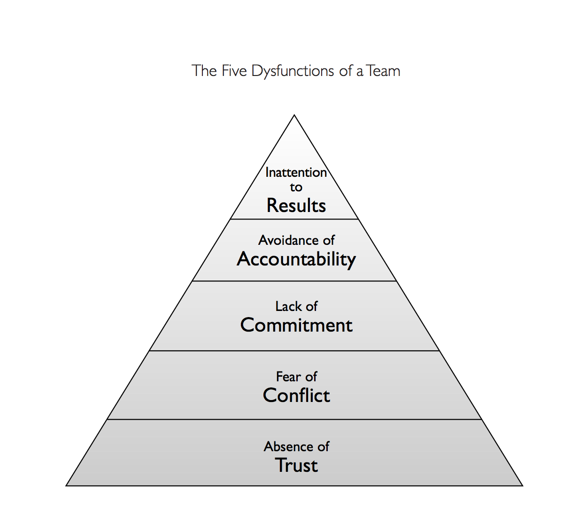

## Main gist
### The 5 Dysfunctions
* Lack of trust
	* Team members don't trust others show vulnerability, which means individuals won't
	* This is important because if you aren't vulnerable, it's hard to get to the heart of the matter
	* This relates to conflict, because constructive conflict is about making things better
* Fear of conflict
	* If you can't have constructive conflict you can't get alignment and buy in 
	* This is important for commitment
* Lack of commitment
	* If you aren't bought in, you won't follow through
* Inability to hold people accountability
	* If we can't have constructive conflict around our commitments its hard to ensure that the team is working towards a shared goal
* Inattention to results
	* When folks find it hard to work to a shared goal and have others account for their actions they tend to focus on their own goals over the team goals.

## TOC

* The Fable
	* Luck 
	* Part One: Underachievement
	* Part Two: Lighting the Fire
	* Part Three: Heavy Lifting
	* Part Four: Traction
* The Model
	* An Overview of the Model
	* Team Assessment
	* Understanding and Overcoming the Five Dysfunctions

## Book
### Intro
Teamwork is the ultimate competitive advantage because it is so rare. The author states that many leaders know this already but they are unsure of how to achieve it. This book start by telling a realistic, but fictional story about a CEO dealing with a dysfunctional team and then will introduce methods for how to deal with that situation.

### The Fabel
* Kathryn is put in charge of failing tech company
* Lots of turn over
* Missed expectations

#### Part One: Underachievement
* The CEO is chosen, seems an unlikely pick
* Mostly observes first few weeks
	* To the consternation of everyone else
* She sets up executive offsites as one of her first tasks 
* Her extensive background gives her confidence in her choices regardless of her on knowledge of software
* Introduces the team
	* Known as "The Staff" instead of the team
	* People
		* Jeff former CEO
		* Mikey - Marketing
		* Martin - CTO
		* JR - Sales
		* Carlos - Customer Support
		* Jan - CFO
		* Nick - COO

#### Part Two: Lighting the Fire
* Team announces there is a Sales opp but it conflicts with the first executive offsite 
* CEO asks team to move the sales meeting
	* She is met with a lot of resistance
	* She continues to reiterate that her first job is to rescue the company, and thats more important then any one sales opp
* The Offsite
	* CEO explains frankly why everyone is there
	* She shares the problem she sees
	* Explains that the goal of the offsite are to "Achieve results"
	* People might not like the changed company afterward
* She sees a lack of trust
	* That seems to stem from her perception that there is a lack of debate 
* She sets some ground rules for the meeting involving being present
* They spend time getting to know one another
* The show vulnerability
* She gets everyone to derive some shared goals
* They identify them and then almost get into a conflict, but then it fizzles 
* People start to have some conflict, and CEO continues to point at lack of information flow
* Seems to have convinced the group of serious issue, but they are skeptics 
* Finishes explaining the dysfunctions 
* Finally two ours spent talking about conflic
	* Meetings should be as interesting as movies, you shouldn't always know exactly how they will turn out
	* Should be a place for debate
* Then she gets people to debate what the most important goal for the rest of the year should be
	* Folks begin to engage in debate
* After a good debate, with clear back and fourths people are feeling better

#### Part Three: Heavy Lifting

##### On Site

* CEO Notices that all forward progress seems to have deteriorated 
* Meeting to talk about potential acquisition 
* Team member explodes on CEO
	* They talk privately
	* redirect energy towards big picture

##### Fireworks
* Starts with a staff meeting
* Nick shows some vulnerability
* Senior Staff member quits
* Nice replaces Jr

##### Leaks
* CEO finds out that staff are finding out what happens at the off site

##### Off-site Number Two
* CEO wants to know who's talking to the staff about off-sites
* Martin admits to talking to his staff out of duty
* Staff admits that their teams are more important then the senior staff
* CEO re-enforces role of current team

##### Plowing On
* CEO Asks: "How are we working as a team?"
* Mixed reaction
* Some think they aren't investing in the right way to achieve the goals
* Set's up a conflict that they have to figure out
* They worked as a team to solve a hard problem

##### Accountability
* When they start looking into the status of a project
* Senior staff member hasn't done the work
* They are working on getting information to flow sooner
* When you spend time and resources you should be able to communicate the value of that work.
* With respect, everyone should be talking about resource usage

##### Individual Contributor
* Mikey (marketing) has completed pallets without input.
* While the work is good, they aren't a team player
* CEO decides she might need to let Mikey go

##### The Talk
* CEO Starts out by letting mikey know whats going on
* They have mixed feelings

##### The Last Stand
* Mikey isn't going easy
* After explaining that her behavior had to change to say Mike volunteered to leave

##### Flack
* Team deals with fall out

##### Heavy Lifting
* More dealing with fall out

##### Rally
* CEO Builds on the off-sites pushes them to grow

#### Part Four: Traction

##### Harvest
* Team was working its way up the pyramid
* Although the company is still behind

##### Gut Check
* There is an offer on the table for the company
* The senior team decided not to accept the offer

##### The March
* Things are good
* the CEO downsized the team

### The Model
"this section is designed to provide a clear, concise, and practical guide to using the Five Dysfunctions Model to improve your team. Good luck."

#### An overview of the model 
* Genuine teamwork is elusive
* It doesn't happen because they have the 5 dysfunctions
* The issues aren't separate, but interlated

The dysfunctions are

1. Absence of trust: Stems from the unwillingness to be vulnerable within the group. Lack of openness 
2. Fear of conflict: without trust you can't have difficult conversations
3. Lack of commitment: It's hard to get buy in if folks haven't had open and honest conversations
4. Avoidance of accountability: Because theres no clear commitments its hard to hold everyone accountable
5. Inattention to results: When you don't have a clear actionable plan to achieve a result as team it might be easier to focus on individual results.

Another way to look at it, in order to have a truly cohesive team you need.

1. To trust one another
2. To engage in unfiltered conflict around ideas
3. Commit to decisions and plans of action 
4. Hold one another accountable for delivering against those plans
5. Docs on the achievement of collective result

#### Team Assesment
* Provides a tool to asses your team

#### Understanding and overcoming the five dysfunctions

##### Dysfunction 1: Absence of trust

###### What does it look like

* Trust is important, but the word is used and missed 
* In terms of team building. Trust means:
	* Folks think each others intentions are good
	* There is no reason to be protective or careful around the group
* Which is different the saying that folks have produced good work in the past and you trust they will continue to do it.
* This kind of trust requires folks to be be vulnerable
	* They might have some weakness's that need help
	* There might be a skill gap that can be closed
	* They might not communicate well
	* They will make mistakes
	* They might ask for help
* If we don't trust our team it's hard for us to show vulnerability 
* People instictintivley to hide these kinds of things 

###### How to overcome

* It will take time
* Approaching it directly is your best tool 
* Exercises
	* Personal History
		* Each team member answers questions about them self
		* Increases empathy
	* Team Effectiveness
		* Team identifies single most important contribution that each peer makes, as well as one are they must improve upon or eliminate for the good of the team.
		* Might be good for trust to exist first 
	* Personality and Behavioral Preferences Profiles
		* Doing Myers-Briggs type stuff
	* 360-Degree Feedback
	* Experimental team exercises: Ropes courses, etc
* While exercises can have a big impact, they must fe followed up with

###### The role of the leader

* Leader must demonstrate vulnerability for this to work
* Create environments where folks aren't punished for vulnerability 

###### Connection to Dysfunction 2

* Building trust allows for constructive conflict

##### Dysfunction 2: Fear of conflict
* All relationships require conflict in order to grow.
* At work sometimes conflict is considered bad
* It's important to distinguish productive conflict from other conflict
* Productive teams
	* Keep it to a minimum
	* Disscuss and resolve issues quickly
	* Leave heated debates with no residual feelings or collateral damage
	* Ready to take on the challange
* Teams that avoid this kind of conflict
	* Hurt peoples feelings
	* Encourage bad conflict
	* Back channels form
* Taking issues "offline" can be away to avoid conflict

###### Suggestions for overcoming dysfunction 2

* Teams that fear conflict:
	• Have boring meetings
	• Create environments where back-channel politics and personal attacks thrive
	• Ignore controversial topics that are critical to team success
	• Fail to tap into all the opinions and perspectives of team members
	• Waste time and energy with posturing and interpersonal risk management
* Teams that engage in conflict:
	• Have lively, interesting meetings
	• Extract and exploit the ideas of all team members
	• Solve real problems quickly
	• Minimize politics
	• Put critical topics on the table for discussion

Methods for making conflict more common and productive
* Mining: 
	* Someone should assume the role mining conflict
	* Requires some objectivity
	* Stay with it till the conflict is resolved
	* Requires fortitude
* Real-time Permission:
	* In the process of mining, team member should help other stick with it
	* Recognize when folks are becoming uncomfortable
	* Remind folks that this is nescecary 
	* When it's over awknoledge the issue
* Other Tools:
	* Thomas-Kilman Conflict Mode Instrument 
		* Helps understand how teams see conflict
	
###### The Role of the Leaders

* Restrain them selves from managing conflict
* Allow for resolution on its own
* They must model conflict them selves

###### Connection to Dysfunction 3

Constructive conflict allows folks to get on the same page about what matters. Without conflict it can be hard to truly commit to the plan

##### Dysfunction 3: Lack of Commitment 

* Commitment is:
	* Clarity
	* Buy In

*  Contributing factors to lack of commitment
	* Consensus:
		* Complete agreement isn't always possible
		* Sometimes folks just want to be heard and considered
		* When it's not possible due to an impasse the leader makes the call
	* Certainty:
		* Create a clear course of action, even if they may be wrong
		* A decision is better then no decision
		* Better to make a bold decisions and be wrong, and also be willing to make a change. Then to waffle

* Waffling at the executive level creates deep conflict in their teams who then have to deal with lack of buy in

* A team that fails to commit :
	• Creates ambiguity among the team about direction and priorities
	• Watches windows of opportunity close due to excessive analysis and unnecessary delay
	• Breeds lack of confidence and fear of failure
	• Revisits discussions and decisions again and again
	• Encourages second-guessing among team members
• A team that commits
	• Creates clarity around direction and priorities
	• Aligns the entire team around common objectives
	• Develops an ability to learn from mistakes
	• Takes advantage of opportunities before competitors do
	• Moves forward without hesitation
	• Changes direction without hesitation or guilt

###### Suggestions for Overcoming Dysfunction 3

* Cascading Messainges
	* Before leaving key meetings review all decisions, and what needs to be communicated
	* Can expose differences in understandings
* Deadlines
	* Ambiguity is hard for this dysfunction setting deadlines can help overcom
* Contingency and Worst-Case Scenario Analysis:
	* Disscussion this up front can allow teams to let go of waffling and embrace a plan knowing that there is a plan B
* Low-Risk Exposure Therapy:
	* In a low-risk situation
	* having a good discussion, but don't analyze, instead commit
	* Recognize, and evaluate how it worked out

###### The Role of the Leader

Leader needs to be cool making designs that can turn out to be wrong

###### Connection to Dysfunction 4
In order to hold everyone accountable there needs to be a clear sense of what was expected.

##### Dysfunction 4: Avoidance of Accountability 
Accountability is the willingness of team members to call their peers on performance or behaviors that might hurt the team.

The dysfunction is when members don't call each other on behavior and a tendency to avoid difficult conversations.

Hard to do, folks who are close are can be harder to call folks out.

Peer pressure could help here.

###### Suggestions for overcoming dysfunction 4

* A team that avoids accountability:
	• Creates resentment among team members who have different standards of performance
	• Encourages mediocrity
	• Misses deadlines and key deliverables
	• Places an undue burden on the team leader as the sole source of discipline
* A team that holds one another accountable:
	• Ensures that poor performers feel pressure to improve
	• Identifies potential problems quickly by questioning one another’s approaches without hesitation
	• Establishes respect among team members who are held to the same high standards
	• Avoids excessive bureaucracy around performance management and corrective action

* Tools
	* Publication of Goals and Standards
		* Helps folks keep each other accountable
		* Reduced ambiguity
	* Simple and Regular Progress Reviews
		* Lets people check in on their path
		* Reduces stress of feedback
	* Team Rewards
		* Shifting rewards away from individual performance and towards team can create a culture of accountability 
###### The Role of the Leaders
Let team members hold teacher other accountable, instead of the leader. You must be willing to make hard decisions.

######  Connections to Dysfunction 5
If teams cannot hold each other accountable they will turn away from shared goals and instead focus on personal goals.

##### Dysfunction 5: Inattention to Results

"The tendency of members to care about something other then the collective goals of the group"

The ability to focus on specific objects and clearly defined objects is a requirement for a high performing team.

This doesn't just have to be financial stuff, anything that is outcome based. 

The organization must make the goals, and sub goals clear so teams can hold them selves accountable.

What do teams focus on when they aren't focusing on shared goals?

* Team status: Being apart of the team is the most important thing
* Individual Status: Focusing on how to improve there station over the team

Some teams just aren't focused on results. They are consumed by achieve the results.

###### Suggestions for overcoming Dysfunction 5

Make results clear and reward things that move closer to results.

* A team that is not focused on results ...
	• Stagnates/fails to grow
	• Rarely defeats competitors
	• Loses achievement-oriented employees
	• Encourages team members to focus on their own careers and individual goals
	• Is easily distracted
* A team that focuses on collective results ...
	• Retains achievement-oriented employees
	• Minimizes individualistic behavior
	• Enjoys success and suffers failure acutely
	• Benefits from individuals who subjugate their own goals/interests for the good of the team
	• avoids distractions

* Tools
	* Public Declaration of Results
		* Making things public makes them clear 
		* Teams willing to commit set them selves up for success 
	* Results-Based Rewards: 
		* Reward things that produce results
		

###### The role of a Leader

Leader must set the tone of deliver results. They must reward results.

