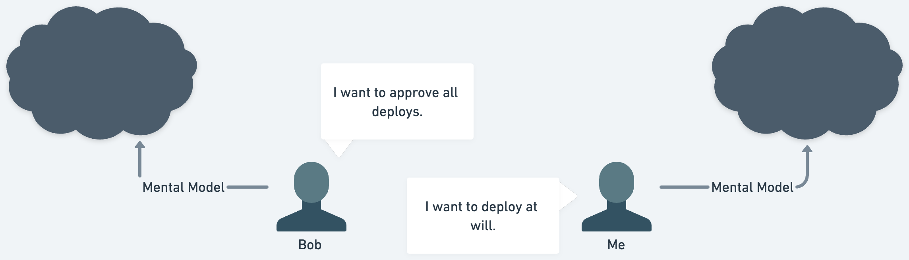

You want to get hard things done, and you want to tackle progressively bigger things. We all do. If you are reading this you chose to do a hard thing. You probably use hard work and elbow grease to do the job. While that kind of work is valuable, at a certain level of complexity, those tools loose their usefulness. And yet, you still want to do the hard thing. This is a good news/bad news deal. The good news is that you chose to show up and you are’t scared of hard work, the bad news — the tools that got you here aren’t going to take you to the next level. You need new tools to get bigger harder things done.

This one weird trick will do a lot of heavy lifting and while it’s easy to read and understand, it’s suprisngly difficult to put into practice.
 
**Stop explaining your self and be curious.** Attempt to understand what the people you are working with are trying to achieve. Attempt to understand their motivations. Do this by asking more questions, especially in a curious manner.

That’s it. If you stopped reading right now, and started asking more questions in a curious manner you’ll probably figure out the rest.

But, If you are curious about how this works, I'll try and explain it, from layman’s perspective.
  
## An example of the unreasonably effectiveness and power of curiosity

A number of years ago I worked for a company that built software, but did not think of it's self as a tech company. Which meant that it wasn't always evovling its tech investments in the same way a tech company might. Starting the late 90's it was old for a company that delivered consumer software via the web.Over the years though, as they evolved the system, they want it to be more like other kinds of consumer web applications and that required bringing in folks like my self who had a consumer web background.

After almost a year of working on a new system, we released a new version of an existing product that was built on a whole new stack. An important detail here is that one of the first things that I did was introduce CI/CD. This was before we had started shipping the product to consumers. I hadn’t really mentioned this to anyone outside of engineering.

So, the release comes and goes, and engineering just keeps on working. We are fixing bugs, there were many, and shipping features as we finished them. Then one day I was yanked into my managers office. The product manager, Bob (not his real name), was there. While not openly hostile, I could tell that he was upset and I had no idea why. My manager trying to be an arbitrator said, “Bob has an issue he’d like to discuss with us”. Bob started to explain his issue, and it boiled down to one thing. He wanted to approve every deployment. This was surprising to me because I felt like engineering should be able to deploy at will. At this point the tension in the room was pretty high because we were at an impasse.

Let’s take a step back from this example though and break down this situation in a technical systems manner.

Bob is a human, with a mind of his own, filled with complexity that is impossible to articulate fully with the English language or any language for that manner. Through his experience he has built up a large number of mental models that help him to reason about the world. On top of that because he is human, he has a whole emotional world that interacts with his mental models which create actions in complex ways. All the same goes for me. And, in that moment we are both trying to bring to bear all the power of our minds to get what we want, and yet the grand total of what we have communicated is like 10-15 words each.

While this went unsaid, I think it's fair to say, that what happened first is that we both reacted emotionally. How dare [the other person] own the thing I am in charge of.

If we diagram the systems in this conversation, we can see that this small exchange, while generating a lot of emotion, was filled with a lot of mystery. Even though our statements brought us to an impass, the inner workings of our minds that brought us to utter these words were black boxes to one another.

Sidenote: This is a story about the past, we are in the future. You might be screaming about things like DORA report, feature flags, WIP limits. I get it, but put those things aside for a moment.

Some other things to know. We were relatively new to working with one another. He had worked at the same company for many years and I had come to this company after working at a number of startups that had worked with rapid deployment models.  
  
At this point I could have explained to him all the things I knew about CI/CD the benefits, the value, etc. I could have done that, but what would I have gotten? In that moment probably nothing. None of what I had to say would have spoken to his concerns in that moment. Furthermore, I couldn't have spoken to his concerns, because his thinking was a black box.
  
Luckily, instead of doing that I asked a question. "Why do you want to do that?". He had a relatively simple answer. "I am the product manager, I want to ensure that new features meet my expectations before they are released and in some cases I want to coordinate PR when we release anticipated features.”. From the future I saw that coming, but in that moment I didn't because of my black box. In it was all the experience of working at small startups with out product managers. All of my experience said that I was 100% qualified to be a product manager, and when you ship software pre product market fit — no one cares! My black box was structurally in capable of understand what would lead him to want such a thing. But, because I reacted in a curious manner, instead of trying to explain my self, I was able add a new piece of information to my black box, and immediately understand his position.
  
So, then I was able to follow up. "That's interesting, I'm really sorry I didn't pull you in. Frankly, I hadn't thought to do that. In the last few places I've worked we didn't wait for Product Approval." I owned my actions, regardless of my intention, I had in a small way harmed Bob. I am also human though and wanted him to understand a little bit about my motivations so I explained what led me to take those actions.

I continued, "I'm curious, I think you are talking about feature X", he agreed, "Again sorry for not explaing this earlier, but becaose of the way we deploy the site we fixed roughly 50 bugs around the same time we shipped feature X.“. He expressed surprise, he didn't realize that we were fixing bugs almost as fast as they were being reported. In his experience teams kept backlogs of bugs and would do a bug bash period at the end of a big water fall process. His black box structurally prevented him from seeing value of our process. After he had added more information to his black box, he was able to see how our process gave him more of what he wanted. Bugs addressed more quickly without him having act like a program manager.
  
At this point, with our black boxes slightly less of a mystery. I understood what his motivations were for wanting what he wanted and vice versa. This put us in a new position, instead of having two contradictory things we had a new shared problem. How do we allow eng to deploy at will, but give product control over feature releases?
  
The answer to this was feature flags. Interestingly, the engineering team had this on our backlog, but had not yet done it because we were so focused on developing features. The product manager was able to immediately recognize the value of of these flags. He even went so far as to recommend that we wouldn't need feature flags for every feature. If it was something he wanted control over he would flag it early in the process.  

Curiosity here served a valuable function. Not only did it help us navigate the process of exploring each others black box, but it allowed us to find common cause and attack problems together.

At the end of the day we were able to use feature flags in new ways we hadn’t imagined as well, thus our conflict led to an even great increase in productivity. Now, that’s what I call productive conflict! 
  
And, that is only what it did for us technically.
  
The most powerful outcome here is that our team (product + eng) had begun to form a strong and valuable narrative. When we disagree, we will talk with one another to understand each others perspective, we will then use that shared understanding to find common solutions from a shared perspective. Which increased our trust as a team and helped folks feel better about the work they did. 

For me, this particular situation felt like a kernel that amplified over time and allowed our teams to do pretty incredibly things over the following few years.

Over the years, I have seen this dynamic unfold a number of times. Impass leading to curiosity leading to alginment leading to breakthrough. Especially when dealing with the most complex problems, if you aren't uniting and bringing everyones mind to bear on the problem you probably aren't finding the most productive outcomes. And, curiosity plays an outsided role in uniting folks mainly by helping each other get your mental models out into the open.

